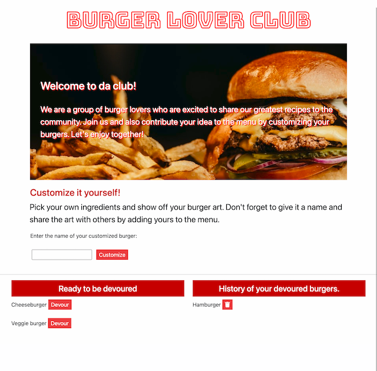

# Node Express Handlebars
# Eat Da Burger

## Description

This is an application that uses MySQL, Node, Express, Handlebars, and a homemade ORM that follows MVC design to build a burger logger.
 Check out the deploy link hosting on Heroku [here](https://eat-da-burger-app-by-uyen.herokuapp.com/).

## Installation

* Run `npm init` from the command line, then install the following modules: `npm install express`, `npm install express-handlebars`, `npm install express-handlebars`.

* Run the `schema.sql` and the `seeds.sql` file in the command line with `mysql -u root -p` to set up MySQL database.

## Usage

This app demonstrates a simple restaurant app that let users input the names of burgers they'd like to order. When the user submits the burger's name, it will be displayed in the left side of the page, waiting to be devoured. When the devour button is clicked, the burger will be displayed on the right side of the page. The burgers are stored in database whether devoured or not. 

## Contributors
This application is created by me with the help from the inital material by Trilogy.
